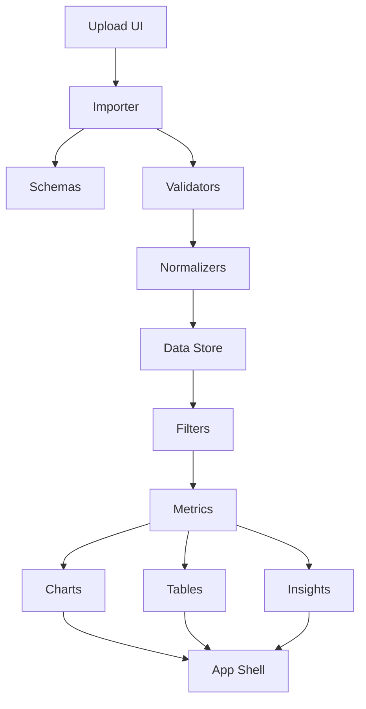

# Architecture Research

## Component Boundaries

## Modules

| Module | Responsibility |
|--------|----------------|
| `app.js` | App boot, navigation, page rendering orchestration |
| `schemas.js` | Expected columns, sheet names, aliases and field definitions |
| `importer.js` | File reading, SheetJS integration and raw sheet extraction |
| `validators.js` | Structural and row-level validation reports |
| `normalizers.js` | Canonical domain records and derived fields |
| `data-store.js` | In-memory state, IndexedDB persistence and restore |
| `filters.js` | Filter state, predicates and filtered dataset composition |
| `metrics.js` | KPI and aggregation calculations |
| `charts.js` | ECharts setup, lifecycle and chart click filtering |
| `tables.js` | Sort, search, pagination, column filters and CSV export |
| `insights.js` | Financial, commercial and operational alert generation |

## Data Flow

1. User selects Excel files on the upload page.
2. `importer.js` reads workbooks with SheetJS from local vendor code.
3. `schemas.js` identifies expected sheets and columns.
4. `validators.js` creates validation reports with severity levels.
5. `normalizers.js` removes totals and converts rows into typed domain records.
6. `data-store.js` stores normalized records in memory and IndexedDB.
7. `filters.js` derives filtered datasets per page.
8. `metrics.js`, `insights.js`, `charts.js` and `tables.js` render current views.

## UI Architecture

Use one static shell with fixed sidebar and topbar. Pages are client-side views controlled by route state or active nav state. Avoid framework-specific patterns so the app remains distributable as static files.

The design system should be implemented as CSS custom properties from `docs/TOKENS.md`, with semantic utility classes for badges, cards, tables, buttons, forms and layout. The dashboard executive can allocate more space to ECharts, while operational pages should keep tables and exception lists prominent.

## Build Order

1. Static shell and design tokens.
2. Schemas and import pipeline.
3. Validation and normalization.
4. Store and filters.
5. Metrics and table rendering.
6. ECharts dashboards.
7. Insights, alerts and meta indicators.
8. Polish, accessibility and offline dependency verification.
